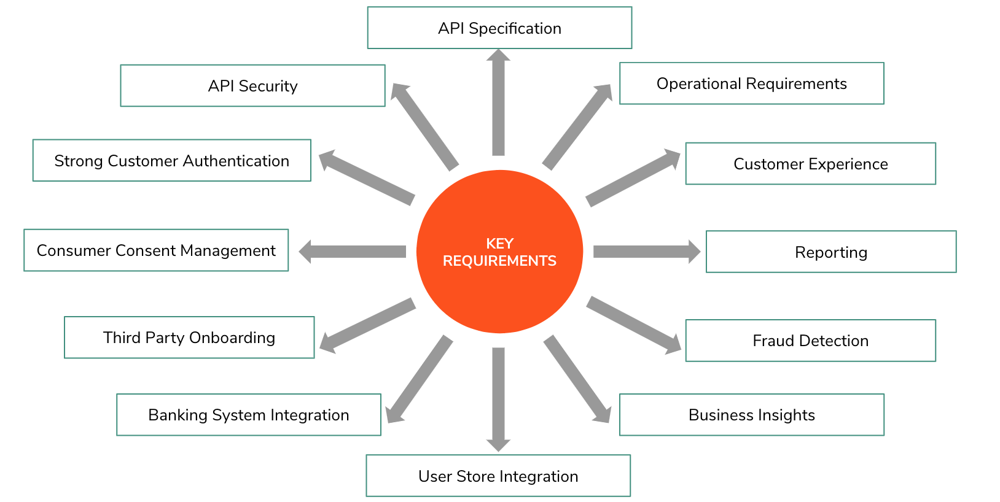
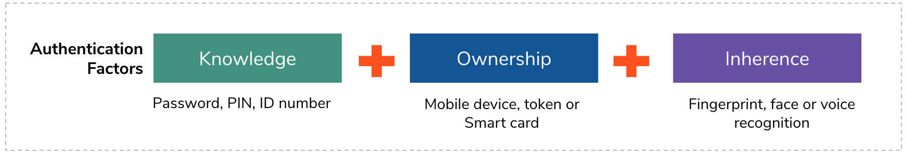
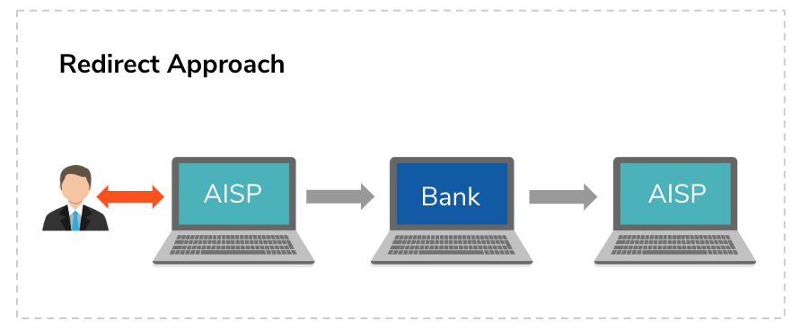
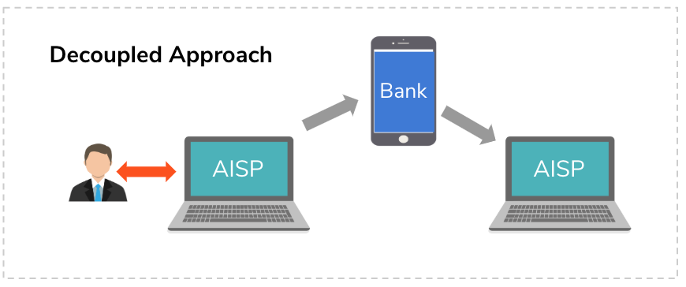
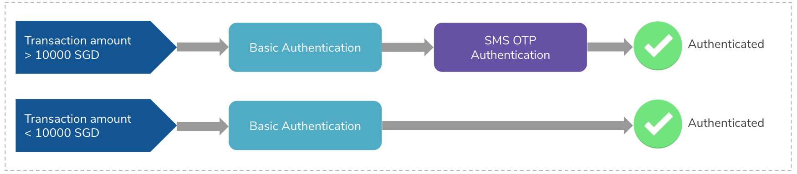

A implementação de uma arquitetura de banco aberto bem-sucedida é crítica para um banco aproveitar totalmente os benefícios do banco aberto. Todos, desde o responsável pela conformidade até o gerente de projeto de open banking e o CTO, precisam ter total confiança na plataforma de open banking que você escolher. Sua arquitetura de banco aberto desempenha um grande papel na determinação da eficácia com que você abre suas APIs, fornece uma experiência terceirizada perfeita e, por fim, oferece uma jornada do cliente melhor do que a de seus concorrentes.

Este artigo explicará quais são os principais requisitos que você precisa considerar ao implementar uma arquitetura de banco aberto bem-sucedida e como o WSO2 como um provedor de solução de banco aberto ajuda os bancos a implementar a plataforma de banco aberto.

## Arquitetura de Open Banking Proposta

Nosso objetivo é expor com segurança os dados e serviços internos a terceiros externos com o consentimento do cliente por meio de APIs RESTful. Assim, terceiros podem consumir essas APIs e gerar novos serviços para os clientes do banco. No entanto, não se trata apenas de expor APIs e implementar uma camada de gerenciamento de consentimento, há muitos outros requisitos ao implementar uma plataforma de banco aberto, como gerenciamento de API, segurança de API e outros requisitos funcionais e operacionais.

## Requisitos Chave

## Especificação API

Em primeiro lugar, cada banco definitivamente precisa definir uma especificação de API adequada para garantir que a maneira como um banco expõe seus dados e serviços internos a partes externas seja padronizada e bem definida. Ao pensar sobre os dados e serviços existentes, pode haver algum conjunto de dados que podem ser expostos por meio de APIs abertas. Por exemplo, caixas eletrônicos, agências, taxas de câmbio e taxas de juros podem ser expostas por meio de APIs abertas. Mas se um banco deseja expor informações de contas de clientes do banco ou precisa fornecer um serviço para fazer pagamentos, essas APIs precisam ser expostas como APIs protegidas.

## Segurança API

Depois que a especificação da API é definida e exposta externamente, os bancos precisam pensar em como restringir o acesso às APIs apenas a terceiros autorizados. Os bancos precisam implementar uma camada de segurança para APIs expostas. Principalmente token OAuth2 ou autenticação de terceiros baseada em certificado e mecanismos de autorização são amplamente usados em diferentes sistemas bancários abertos.

## Autenticação forte do cliente

Ao compartilhar dados de clientes com terceiros, os bancos precisam obter o consentimento do cliente. Ao fazer isso, primeiro o banco precisa identificar fortemente o cliente. Autenticar usuários apenas por meio de um fator de autenticação não é suficiente. Deve haver autenticação multifator onde pelo menos uma combinação de dois fatores de conhecimento, propriedade e herança deve ser usada.

Bancos diferentes usam combinações diferentes de fatores de autenticação de básico, SMSOTP, Vasco, impressão digital, voz, Facebook, Google e muito mais. Além disso, bancos diferentes usam abordagens diferentes para autenticar usuários . A abordagem de redirecionamento e a abordagem desacoplada são abordagens de autenticação amplamente utilizadas em diferentes países. Além disso, as abordagens incorporadas, mistas e delegadas também podem ser usadas.

A abordagem de redirecionamento é onde o usuário do banco é redirecionado para o portal de autenticação do banco a partir do aplicativo de terceiros. Depois que o usuário for autenticado e receber o consentimento, o usuário será redirecionado de volta ao aplicativo de terceiros. Esse redirecionamento pode ser feito por meio de um navegador ou por meio de um aplicativo móvel.

A abordagem dissociada é onde o usuário do banco não será redirecionado para o portal de autenticação do banco, mas o aplicativo de terceiros identifica o usuário e faz uma chamada de canal de apoio para o banco dizendo que o aplicativo de terceiros precisa obter o consentimento desse usuário específico. Em seguida, o banco liga para o cliente, talvez por meio de um aplicativo móvel do banco para obter o consentimento do usuário. Assim que o banco receber o consentimento do usuário, ele compartilhará as informações necessárias com o aplicativo de terceiros. Nosso [artigo sobre autenticação forte do cliente](https://wso2.com/library/articles/2019/06/strong-customer-authentication-and-dynamic-linking-for-psd2/) fornece mais detalhes.

Quando um cliente faz um pagamento, ele precisa passar por todas as etapas de autenticação e fornecer seu consentimento todas as vezes, mesmo que essa transação não tenha um risco. Ter que passar por todas as etapas de autenticação iterativamente pode levar a uma experiência ruim do usuário. Deve haver um recurso para identificar o nível de risco de uma transação e, se for baixo, o banco pode isentar o usuário de passar por todos os fatores de autenticação. Isso é o que chamamos de [Análise de Risco de Transação (TRA)](https://wso2.com/articles/2019/05/a-deep-dive-of-transaction-risk-analysis-for-open-banking-and-psd2) .

Ao pensar em uma plataforma de banco aberto, você precisa pensar se essa plataforma terá essa capacidade ou se seu banco já possui uma solução de análise de risco de transação e se pode ser integrada a essa plataforma de banco aberto.

## Gestão de Consentimento do Consumidor

Consentimento de gerenciamento significa que dá autoridade ao cliente do banco para controlar seus dados pessoais e financeiros em termos de quem eles podem ser compartilhados, para qual propósito e por qual período. A plataforma de banco aberto deve ter a capacidade de capturar, armazenar e validar esse consentimento ao compartilhar dados do cliente com terceiros.

## Revogação de consentimento

Revogar o consentimento deve ser tão fácil quanto fornecer o consentimento e a autoridade para revogar o consentimento deve estar disponível para os usuários do banco. Três maneiras foram identificadas em diferentes implementações de banco aberto para revogar os consentimentos do usuário:

- O banco fornece uma interface para os usuários do banco efetuarem login e revogarem os consentimentos.
- O banco fornece uma interface para os oficiais de atendimento ao cliente pesquisarem e revogarem o consentimento em nome do cliente quando o cliente vier ao banco e solicitar a revogação do consentimento. 
- O banco fornece uma API para revogar o consentimento para que terceiros possam fornecer uma funcionalidade de revogação por meio de seus aplicativos.

## Onboarding de terceiros

Quando um terceiro deseja consumir APIs de bancos, eles normalmente vão à loja de APIs do banco, onde podem explorar APIs existentes que são publicadas e ver o que está disponível para desenvolver seus aplicativos. Quando eles realmente desejam usar essas APIs, eles precisam assiná-las, de modo que precisam ser integrados como terceiros registrados no banco.

Ao fazer isso, alguns bancos fornecem um formulário de inscrição onde terceiros podem vir e preencher o formulário para obter acesso. Quando o banco recebe a solicitação de inscrição, há duas maneiras de lidar com esse processo de integração. Alguns bancos querem que seja totalmente automático. Nesse caso, todas as informações são verificadas e a aprovação ocorre automaticamente por meio de um fluxo de trabalho totalmente automatizado. Em certos casos, os bancos desejam que a aprovação seja feita por meio de um processo manual em que alguém examina as informações e as aprova manualmente .

Algumas regiões introduziram um serviço de diretório para fornecer os recursos de integração de terceiros, onde terceiros e bancos vêm e se registram no serviço de diretório e fornecem algumas credenciais que podem ser usadas para identificar os terceiros. Portanto, quando o terceiro se comunica com o banco com essas credenciais, o banco liga para o serviço de diretório, verifica o terceiro e permite o acesso às APIs.

## Recursos de gerenciamento de API e aplicativos

Além de todos os requisitos acima, uma plataforma bancária aberta deve fornecer recursos de gerenciamento de API adequados para terceiros e desenvolvedores de API do banco.

Considerando como terceiros se envolvem com a plataforma de banco aberto, ter uma loja de API para listar as APIs que são publicadas pelo banco e recursos para criar aplicativos, assinar APIs, gerar chaves e monetização de API é essencial. Além disso, é importante exibir análises sobre o desempenho de seus aplicativos e enviar notificações quando uma chamada com falha acontece ou qualquer padrão de chamada de API anormal é identificado . Isso melhoraria a confiança de terceiros para usar a plataforma de banco aberto exposta pelo banco.

Da mesma forma, os desenvolvedores de APIs do banco precisam ter uma maneira adequada de criar e criar versões de APIs e gerenciar o ciclo de vida das APIs que são expostas pelo banco. Os desenvolvedores de API do banco não publicarão a API imediatamente. Eles podem precisar testar essas APIs antes de expô-las externamente. Por outro lado, ao encerrar o suporte de uma API específica, deve haver um período de tempo em que a API está em um estado obsoleto para que terceiros possam mudar para novas APIs durante esse tempo. Além disso, eles também devem ter recursos de análise, relatórios e alertas de API .

## Integração do sistema bancário

Ao expor uma API, precisamos nos conectar aos nossos sistemas bancários existentes. Esses sistemas bancários podem trabalhar com diferentes formatos de mensagem (JSON, XML) e diferentes transportes de massagem (HTTPS/S, VFS, JMS, TCP) . Portanto, a plataforma de banco aberto deve ter a capacidade de se conectar a qualquer tipo de sistema bancário interno ou externo.

## Integração da Loja do Usuário

Nesse ecossistema de banco aberto, há uma série de usuários envolvidos, ou seja, funcionários do banco que mantêm toda a plataforma, usuários do banco que usam os produtos e serviços e terceiros que consomem as APIs que são expostas pelo banco e desenvolvem serviços.

Funcionários e usuários do banco já residem em lojas de usuários diferentes, e precisaríamos fornecer um local para manter os terceiros. Os armazenamentos de usuários podem ser de diferentes tipos, como LDAP, AD ou JDBC e diferentes usuários devem ser capazes de fornecer direitos de acesso diferentes . Por exemplo, os responsáveis ​​pelo atendimento ao cliente devem ser capazes de acessar o portal de atendimento ao cliente apenas e os desenvolvedores de aplicativos de terceiros devem ser capazes de acessar apenas o portal do desenvolvedor. Portanto, a plataforma de banco aberto deve ter a capacidade de integrar diferentes tipos de lojas de usuários e gerenciar diferentes direitos de acesso de usuários.

## API Analytics, Business Insights, detecção de fraude e relatórios

É realmente útil analisar os dados que estão passando pela arquitetura de open banking. A análise de API pode ajudar a ver o desempenho das APIs expostas e como elas podem melhorar.

Ao considerar os dados que passam por uma plataforma bancária aberta, podemos ver os padrões de gastos dos clientes do banco e identificar alguns insights de negócios para melhorar o negócio bancário.

Especialmente ao fazer pagamentos por meio da plataforma de banco aberto, podem ocorrer fraudes. Portanto, deve haver uma solução de detecção de fraude adequada conectada a esta plataforma e se o banco já tiver uma solução de detecção de fraude, um banco pode ser capaz de conectá-la sem comprar uma nova solução.

Os recursos de relatório são necessários para gerar relatórios para a administração do banco, terceiros e partes interessadas relevantes para ver como a plataforma de banco aberto está funcionando e para tomar as decisões de negócios necessárias.

## Experiência do Cliente

Entre todos os requisitos principais, a experiência do cliente também tem a maior prioridade. Se a solução não atender à experiência esperada do cliente, ninguém usará os produtos e serviços fornecidos por meio da plataforma de banco aberto.

Por exemplo, se olharmos para a autenticação forte do cliente e fluxo de captura de consentimento, deve

- Tenha uma navegação simples e fácil sem qualquer demora
- Forneça as informações necessárias e corretas para os clientes do banco tomarem uma decisão
- Seja fácil como um cliente de banco se comunicaria com o banco diretamente

Ao selecionar a abordagem ou os mecanismos de autenticação, você deve pensar em como isso afetaria a experiência do usuário para os clientes do banco e se ela se adequará à confiança que os clientes já têm com o banco.

As interfaces de usuário, emails, alertas, relatórios e mensagens de erro das chamadas de API também devem proporcionar uma melhor experiência do usuário e tudo deve estar de acordo com o padrão que é especificado pelo banco.

## Requisitos operacionais

Existem alguns requisitos operacionais que um banco precisa considerar ao pensar em uma arquitetura bancária aberta. Os provedores terceirizados (TPPs) precisam contar com interfaces dedicadas de alta disponibilidade e bom desempenho fornecidas pelo Provedor de Serviços de Pagamento de Serviços de Contas (ASPSPs), para que possam, por sua vez, fornecer serviços confiáveis aos seus clientes. Portanto, a plataforma de banco aberto deve estar altamente disponível e deve funcionar no mesmo nível, mesmo durante o horário de pico ou fora do horário de pico.

O banco deve projetar adequadamente como testar e verificar toda a plataforma antes de colocá-la em produção. Pode haver diferentes tipos de teste envolvidos, incluindo integração, sistema, segurança, aceitação do usuário e teste de estresse. Especialmente ao considerar o teste de estresse, o banco deve replicar o ambiente bancário real e verificar se toda a plataforma oferece uma solução livre de obstáculos. Testes de estresse robustos garantirão que a plataforma de banco aberto seja capaz de lidar não apenas com as demandas previstas, mas também com os períodos de pico mais altos do que o normal.

Os bancos podem fornecer recursos de teste para terceiros antes de seu aplicativo entrar no ar, para que os bancos possam identificar e corrigir problemas com antecedência. Ao mesmo tempo, com o envolvimento de terceiros, os bancos podem obter mais feedback para melhorar a funcionalidade de sua plataforma de banco aberto e fornecer um bom serviço para terceiros.

Quando um terceiro encontra um problema com a plataforma bancária aberta de um banco, isso pode ter um impacto direto na capacidade de um terceiro de fornecer seu serviço, o que, por sua vez, tem o potencial de causar perda de negócios, risco de reputação, requisitos de recursos adicionais e resultados para os clientes. Portanto , é fundamental ter um sistema de resolução de problemas eficaz . Este serviço pode ser fornecido por meio de um suporte online ou sistema de gerenciamento de tíquetes. A equipe do banco deve ser treinada para lidar e corrigir os incidentes dentro do acordo de nível de serviço (SLA) definido. Se o SLA não for cumprido, deve haver uma maneira de escalar para o gerenciamento adequado.

Além disso, qualquer mudança, como alteração da infraestrutura, software ou configuração, atualização de toda a plataforma de banco aberto, correção de um bug e publicação de uma nova versão da API, pode afetar a capacidade de terceiros de fornecer seus serviços aos clientes. Como tal, a capacidade de identificar e comunicar a terceiros o impacto potencial que as mudanças propostas podem ter também é fundamental para um ecossistema de banco aberto bem-sucedido.

## Como diferentes regiões atenderam a esses requisitos

Alguns países já tomaram a iniciativa de avançar para um banco aberto. Eles criaram diferentes padrões e especificações que evoluíram ao longo do tempo, enquanto faziam muitos experimentos e reuniam conhecimento nessa área. Portanto, será realmente útil se considerarmos esses padrões e especificações para implementar uma arquitetura de banco aberto para seu país ou seu banco.

Aqui estão alguns dos padrões e especificações que diferentes países ao redor do mundo seguem:

- Reino Unido - https://www.openbanking.org.uk
- Europa - https://www.berlin-group.org/psd2-access-to-bank-accounts
- França - https://www.stet.eu/en/psd2
- Nova Zelândia - https://www.paymentsnz.co.nz
- Austrália - https://www.accc.gov.au/focus-areas/consumer-data-right-cdr-0
- Nigéria - https://openbanking.ng

## WSO2 Open Banking

Considerando todos os principais requisitos acima e como as diferentes regiões atenderam a esses requisitos, criamos o [WSO2 Open Banking](https://wso2.com/solutions/financial/open-banking/) . Atualmente, ele suporta as especificações openbanking.org.uk, Berlin Group NextGenPSD2 e STET. Estamos trabalhando para a especificação do CDR da Austrália também.

O WSO2 Open Banking é desenvolvido na [WSO2 Integration Agile Platform](https://wso2.com/agility/) , que consiste em [gerenciamento de API , gerenciamento de identidade e acesso, integração empresarial e produtos analíticos](https://wso2.com/identity-and-access-management). Esses produtos WSO2 são bem usados e bem testados com diferentes clientes e casos de uso em todo o mundo. Além disso, eles são 100% open source e totalmente extensíveis, portanto, se seu país não definiu nenhuma especificação para open banking, mas seu banco deseja ter sua própria implementação, isso pode ser suportado via WSO2 Open Banking.

## Conclusão

A implementação de uma arquitetura de banco aberto bem-sucedida é crítica para um banco aproveitar totalmente os benefícios do banco aberto. Para identificar quais são os principais requisitos de uma plataforma de banco aberto e como eles podem ser implementados, selecionar a tecnologia certa é uma prioridade. O WSO2 Open Banking foi construído considerando os padrões e especificações que diferentes regiões e bancos seguiram. Os bancos podem aproveitar essa tecnologia para criar uma arquitetura de banco aberto de sucesso, melhorando assim seus serviços ao cliente e negócios bancários.

---

[Artigo Original](https://wso2.com/articles/2019/08/implementing-a-successful-open-banking-architecture/)

Autor: Amalka Subasinghe

