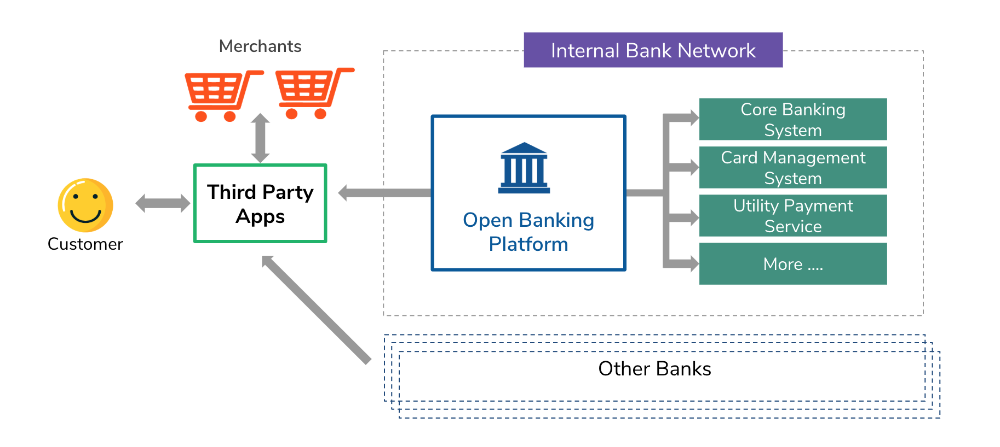

A implementação de uma arquitetura de banco aberto bem-sucedida é crítica para um banco aproveitar totalmente os benefícios do banco aberto. Todos, desde o responsável pela conformidade até o gerente de projeto de open banking e o CTO, precisam ter total confiança na plataforma de open banking que você escolher. Sua arquitetura de banco aberto desempenha um grande papel na determinação da eficácia com que você abre suas APIs, fornece uma experiência terceirizada perfeita e, por fim, oferece uma jornada do cliente melhor do que a de seus concorrentes.

Este artigo explicará quais são os principais requisitos que você precisa considerar ao implementar uma arquitetura de banco aberto bem-sucedida e como o WSO2 como um provedor de solução de banco aberto ajuda os bancos a implementar a plataforma de banco aberto.

Arquitetura de Open Banking Proposta

Nosso objetivo é expor com segurança os dados e serviços internos a terceiros externos com o consentimento do cliente por meio de APIs RESTful. Assim, terceiros podem consumir essas APIs e gerar novos serviços para os clientes do banco. No entanto, não se trata apenas de expor APIs e implementar uma camada de gerenciamento de consentimento, há muitos outros requisitos ao implementar uma plataforma de banco aberto, como gerenciamento de API, segurança de API e outros requisitos funcionais e operacionais.

