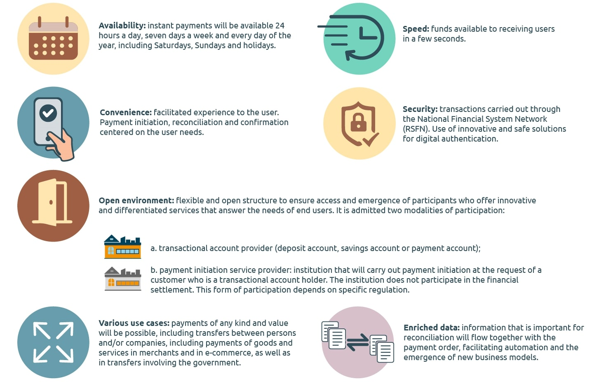

Pix é a implementação do ecossistema de pagamentos instantâneos liderado pelo Banco Central do Brasil (BCB) para possibilitar transferências de dinheiro online com custos reduzidos, maior segurança e disponibilidade 24 horas por dia, 7 dias por semana. As transferências ocorrem diretamente da conta do pagador para a conta do beneficiário, sem a necessidade de intermediários, resultando em menores custos de transação.

Pix estará disponível para pessoas e empresas. Ambos precisam ter uma chave identificadora registrada em alguma entidade financeira - bancos, fintechs ou instituições de pagamento - para prosseguir com a transação. De acordo com os critérios de elegibilidade estabelecidos pelo BCB, certas entidades serão obrigadas a oferecer essa forma de pagamento, enquanto outras poderão oferecê-la opcionalmente ou não.

Nesta etapa, vamos explicar como estender a implementação do protocolo do provedor de pagamento para permitir que as lojas ofereçam Pix como um método de pagamento adicional para seus clientes.

>Esses são alguns dos benefícios de um ecossistema de pagamentos instantâneos destacados pelo BCB

## Condições de integração

Se você está pronto para desenvolver o middleware que implementa nosso protocolo de provedor de pagamento, deve estar ciente destes requisitos:

- Todos os pontos de extremidade devem ser servidos por HTTPS na porta 443 com suporte TLS 1.2. Conexões por HTTP não protegido não serão aceitas em nenhuma circunstância.
- O integrador deve criar um subdomínio ou nome de domínio para os terminais do provedor. Os endereços IP não serão aceitos como nomes em nenhuma circunstância.
- O middleware deve responder de forma consistente dentro dos tempos de resposta estabelecidos. Aplicamos um tempo de resposta máximo de 5 segundos para testes de homologação, bem como um tempo de resposta máximo de 20 segundos para qualquer outra solicitação de API.

